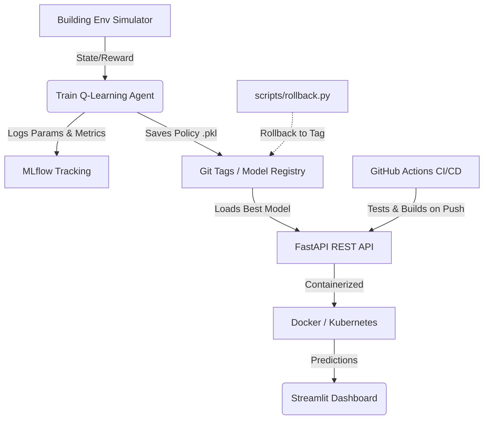

# Smart Energy Management in Buildings
### Reinforcement Learning + MLOps Project

**SDGs addressed:** SDG 11 · SDG 12 · SDG 13  
**Algorithm:** Q-learning (tabular)  
**Stack:** Python · NumPy · Pandas · Matplotlib · PyYAML

---

## Problem Statement

Train an RL agent to control HVAC and lighting across four office-building zones to
**minimise energy consumption** while maintaining **occupant comfort** (20–26 °C).
Baseline: a fixed rule-based timer that runs all equipment during business hours.

### MLOps Architecture



---

## Quick Start

```bash
# 1. Install dependencies
pip install -r requirements.txt

# 2. Train — experiment v1
python train.py --config configs/qlearning_v1.yaml

# 3. Train — experiment v2 (more exploration)
python train.py --config configs/qlearning_v2.yaml

# 4. Evaluate and generate comparison plots
python evaluate.py --policy policies/policy_v2_explored.pkl \
                   --results experiments/results_qlearning_v2.csv
```

All outputs are saved automatically to `policies/`, `experiments/`, `logs/`, and `reports/`.

---

## Reproducibility

All random seeds are set in the YAML config files (`experiment.seed`, `environment.seed`).
Running the commands above on any machine with `requirements.txt` installed produces
**identical CSV results, Q-tables, and plots**.

To reproduce experiment v1 exactly:
```bash
python train.py --config configs/qlearning_v1.yaml
# → produces policies/policy_v1.pkl and experiments/results_qlearning_v1.csv
```

---

## Folder Structure

```
smart_energy_rl/
├── sim/                     # Simulator + agent
│   ├── building_env.py      # 4-zone building environment
│   ├── agent.py             # Q-learning agent
│   └── baseline.py          # Rule-based baseline
├── configs/                 # Experiment YAML configs
├── experiments/             # Per-run CSV logs
├── policies/                # Saved Q-tables (.pkl)
├── logs/                    # JSON run summaries
├── reports/                 # Reports + plots
├── train.py                 # Training entry point
├── evaluate.py              # Evaluation + plots
└── requirements.txt
```

---

## Git Tags

| Tag | Description |
|---|---|
| `exp-qlearning-1` | v1 run: α=0.1, ε_decay=0.995 |
| `exp-qlearning-2` | v2 run: α=0.2, ε_decay=0.990 |
| `final-eval` | Baseline vs RL evaluation |

---

## Results Summary

| Metric | Rule-based | RL policy (v1) | Change |
|---|---|---|---|
| Avg energy cost / episode | 111.60 | 92.94 | **−16.7%** |
| Avg episode reward | −490.47 | −770.85 | — |
| Avg comfort violation / ep | 378.60 | 635.59 | — |

> Numbers produced by: `python evaluate.py --policy policies/policy_v1.pkl --n_eval 100` (seed=0, 100 episodes).

**SDG 13 impact:** ~17% energy reduction → ~1.5–3 tonnes CO₂/year saved per building.

> **Note on DVC:** DVC was evaluated for artifact versioning but not adopted, as policy `.pkl` files are <1 MB and are tracked directly via Git tags.

---

## Reports

- `reports/RL_Report_PartA.md` — RL methodology (algorithm, state, action, reward, convergence)
- `reports/MLOps_Report_PartB.md` — MLOps (versioning, tracking, reproducibility, monitoring plan)
- `reports/Final_Report.md` — Combined final report with SDG impact analysis
- `docs/requirements.md` — **Full requirements analysis**: stakeholders, use cases, functional & non-functional requirements, feasibility, constraints, trade-offs, risks, and traceability matrix

---

## Contributing

See [CONTRIBUTING.md](CONTRIBUTING.md) for branch strategy, PR checklist, and commit conventions.

